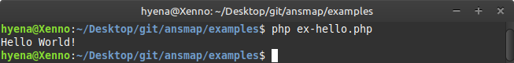
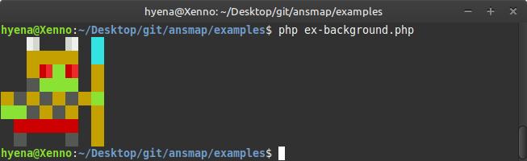
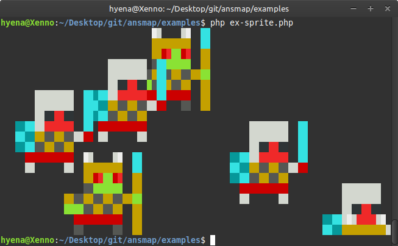
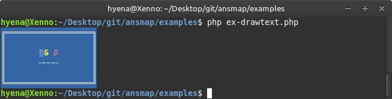
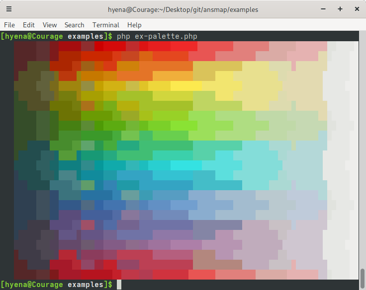
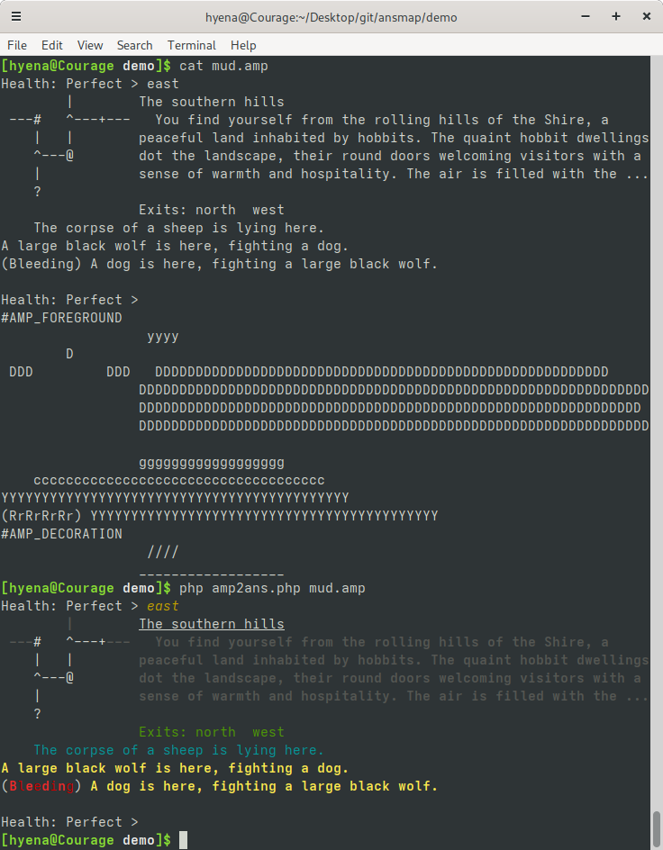
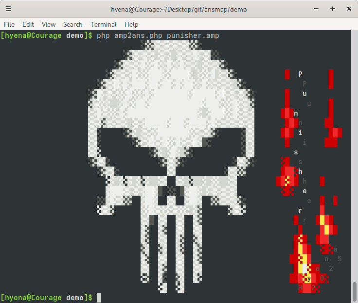

# AnsMap Library ###############################################################

AnsMap is a data structure that stores high level instructions for printing ANSI
art to the terminal. The AnsMap Library is accompanied by a set of methods for
ansmap construction and for the conversion of ansmap images to ANSI escape code
sequences.

# Examples #####################################################################

https://github.com/1Hyena/ansmap/blob/a22750a0cf41e99fe7f00650230efcfe39618dc8/examples/ex-hello.php#L5-L7

********************************************************************************

https://github.com/1Hyena/ansmap/blob/84a20863ff1234b6e1b42e7d8bd559196c99155e/examples/ex-background.php#L5-L17

********************************************************************************

https://github.com/1Hyena/ansmap/blob/f71bcb62fbb2cba008a016bec8cca769a622005d/examples/ex-sprite.php#L27-L40

********************************************************************************

https://github.com/1Hyena/ansmap/blob/332b010fc706dfa4540f5590080ebccfb975aa81/examples/ex-drawtext.php#L7-L22

********************************************************************************

[ex-palette.php](https://github.com/1Hyena/ansmap/blob/master/examples/ex-palette.php)

# Demos ########################################################################

## amp2ans #####################################################################

The amp2ans demo shows off the ansmap (AMP) file format and how such files could
be converted into ANSI escape sequences for the terminal to display. In the
below screenshot the file contents of _mud.amp_ is shown. Then, that
file is given as an input to the
[amp2ans.php](https://github.com/1Hyena/ansmap/blob/master/demo/amp2ans.php)
script which will write the respective ANSI escape sequences into its standard
output.

In the following screenshot the [punisher.amp](demo/punisher.amp) file from the
_demo_ directory has been given as an input to the _amp2ans.php_ script.

# License ######################################################################

The AnsMap Library has been authored by Erich Erstu and is released under the
[MIT](LICENSE) license.
