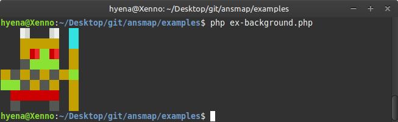

# AnsMap Library ###############################################################

AnsMap is a data structure that stores high level instructions for printing ANSI
art to the terminal. The AnsMap Library is accompanied by a set of methods for
ansmap construction and for the conversion of ansmap images to ANSI escape code
sequences.

# Examples #####################################################################

https://github.com/1Hyena/ansmap/blob/a22750a0cf41e99fe7f00650230efcfe39618dc8/examples/ex-hello.php#L5-L7

https://github.com/1Hyena/ansmap/blob/84a20863ff1234b6e1b42e7d8bd559196c99155e/examples/ex-background.php#L5-L17

# License ######################################################################

The AnsMap Library has been authored by Erich Erstu and is released under the
[MIT](LICENSE) license.
